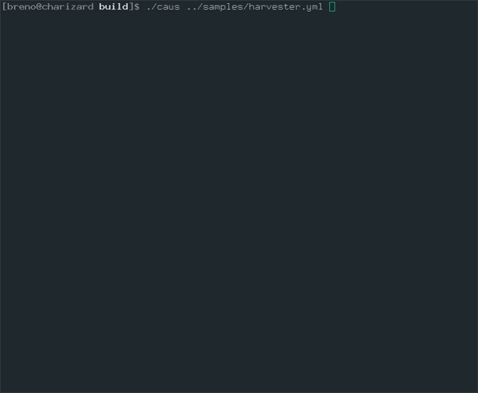
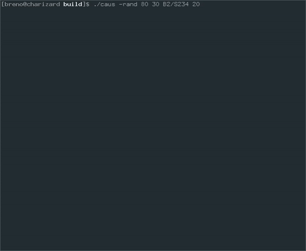

# CAUS

## Description

CAUS is a cellular automaton simulator (its name is an acronym of Cellular
AUtomaton Simulator).
[Cellular Automata](https://en.wikipedia.org/wiki/Cellular_automaton) is a
microstructure modeling, according to
[Wikipedia](https://en.wikipedia.org/wiki/Cellular_automaton),
"a cellular automaton consists of a regular grid of cells, each in one of a
finite number of states, such as on and off (in contrast to a coupled map
lattice)."

### Rulestring and B/S notation.

Rulestrings, according to [LifeWiki](http://www.conwaylife.com/wiki/Rulestring),
"are a way of describing the behavior of various classes of cellular automaton
in the form of a string." B/S notation is a rulestring that defines the rules of
birth (B) and survival (S): B{number list}/S{number list}. This notation allows
to simulate the birth of a cell, survival or death. Each item needs a list of
number of neighbors that make dead cells to come alive (be born) or make live
cells to remain alive (survive).

## Build and Run

Dependencies:

- C++17;
- CMake 3.13.

To build the project, go to the root and, through terminal, run the following
commands:

```
mkdir build
cd build
cmake ..
```

Then, type the following command to run CAUS (see the [samples](samples)):

```
./caus <cellular-automaton-file>.yml
```

Example:

```
./caus samples/cheshire_cat.yml
```

Or generate a random world and set the rulestring manually by using the follow
command:

```
./caus -rand <width> <height> <string_rule> <max_number_of_generations>
```

Example:

```
./caus -rand 20 20 B3/S23 20
```

## Preview

<div style="margin: 0 auto; max-width: 250px;">
	<p align="center">
		
		
    </p>
</div>

## License

This project is licensed under MIT license - see the [LICENSE](LICENSE) file for
details.
